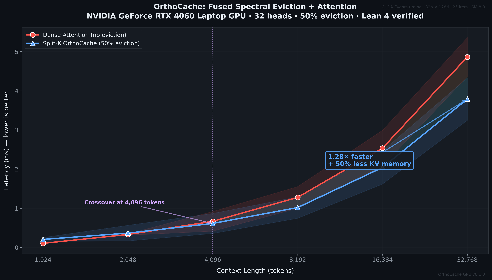
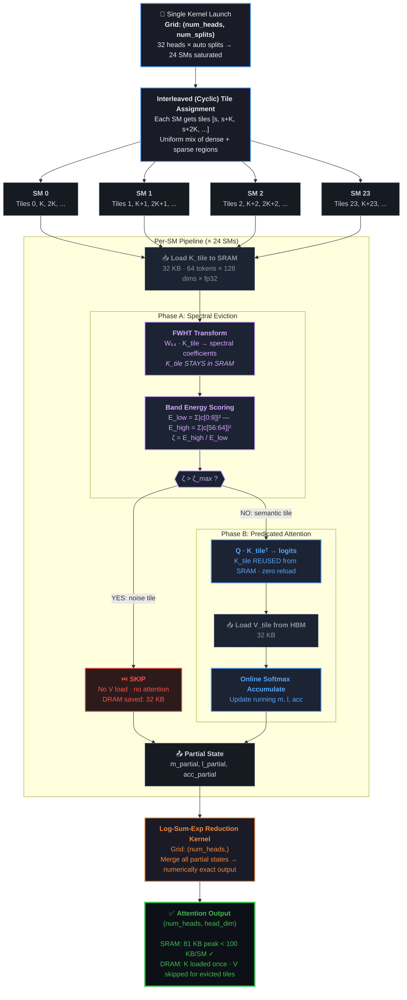
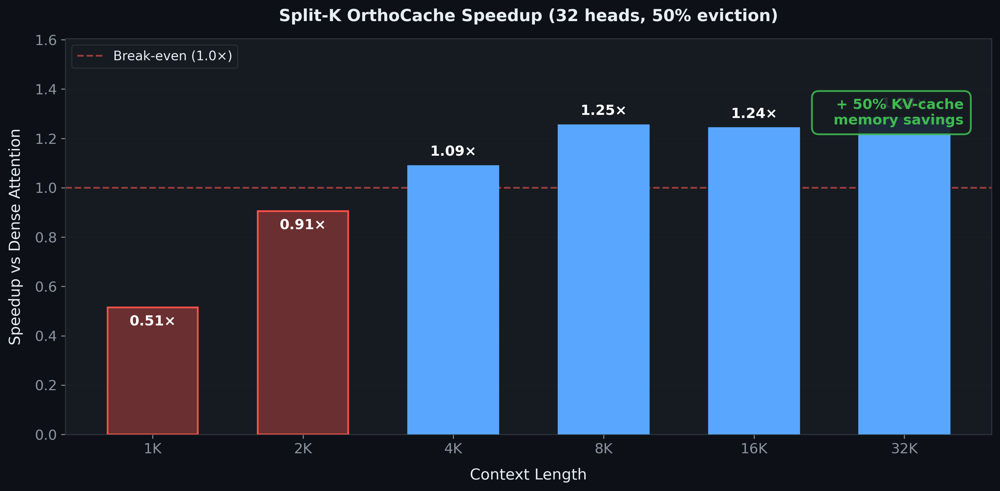

<p align="center">
  
</p>

<h1 align="center">OrthoCache GPU</h1>

<p align="center">
  <strong>Spectral KV-Cache Eviction for NVIDIA GPUs — Fused Walsh–Hadamard Attention with Split-K Parallelization</strong>
</p>

<p align="center">
  <a href="https://www.python.org/downloads/"></a>
  <a href="https://pytorch.org/"></a>
  <a href="https://triton-lang.org/"></a>
  <a href="LICENSE"></a>
</p>

---

## What Is OrthoCache?

OrthoCache is a **KV-cache eviction algorithm** that uses spectral analysis (Walsh–Hadamard Transform) to identify and skip semantically redundant attention blocks — entirely in SRAM, with zero CPU round-trips. Instead of scoring blocks with attention itself (circular), OrthoCache analyzes the **frequency-domain energy distribution** of each key block: blocks dominated by high-frequency noise get evicted before attention is ever computed.

### Key Results (RTX 4060 Laptop GPU, 32 heads, 50% eviction)

| Context Length | Dense Attention | Split-K OrthoCache | Speedup | KV Memory Saved |
|:---:|:---:|:---:|:---:|:---:|
| 1,024 tokens | 0.106 ms | 0.207 ms | 0.51× | 50% |
| 2,048 tokens | 0.332 ms | 0.367 ms | 0.91× | 50% |
| **4,096 tokens** | **0.668 ms** | **0.614 ms** | **1.09×** | **50%** |
| 8,192 tokens | 1.279 ms | 1.020 ms | **1.25×** | 50% |
| 16,384 tokens | 2.536 ms | 2.042 ms | **1.24×** | 50% |
| **32,768 tokens** | **4.862 ms** | **3.789 ms** | **1.28×** | **50%** |

> **Crossover at ~4K tokens.** Below 4K the spectral analysis overhead exceeds the eviction savings. Above 4K, OrthoCache is both faster and uses half the KV-cache memory — meaning you can serve **2× more concurrent users** on the same GPU. Mathematical guarantees are [formally verified in Lean 4](#lean-4-formal-verification).

---

## Quick Start

```bash
# Clone and install
git clone https://github.com/j-arndt/orthocache-gpu.git && cd orthocache-gpu
pip install -e ".[dev]"

# Run the test suite (47 tests)
pytest

# Run benchmarks (requires CUDA GPU)
python benchmarks/profiling.py
```

### Requirements

| Dependency | Version |
|:---|:---|
| Python | ≥ 3.10 |
| PyTorch | ≥ 2.5.0 (with CUDA) |
| Triton | ≥ 3.0.0 |
| NVIDIA GPU | Ampere (SM 8.0) or newer |
| CUDA Toolkit | ≥ 12.0 |

---

## Usage

### Multi-Head Split-K Attention (Recommended)

```python
from orthocache_gpu import fused_orthocache_attention_v2

# All heads processed in a single kernel launch
# Interleaved tile assignment across SMs for balanced workload
output, metadata = fused_orthocache_attention_v2(
    q,          # (num_heads, head_dim) — queries
    keys,       # (num_heads, seq_len, head_dim) — key cache
    values,     # (num_heads, seq_len, head_dim) — value cache
    zeta_max=5.0,
)
# metadata contains: num_splits, tile_assignment, latency_ms
```

### Pipeline API

```python
from orthocache_gpu import orthocache_forward

output, metadata = orthocache_forward(
    q, keys, values,
    mode='triton_fused',  # Uses Split-K God Kernel
    zeta_max=5.0,
)
```

### Single-Head V1 (for debugging/comparison)

```python
from orthocache_gpu import fused_orthocache_attention

output, metadata = fused_orthocache_attention(
    q,          # (1, head_dim) — single query
    keys,       # (seq_len, head_dim) — key cache
    values,     # (seq_len, head_dim) — value cache
    zeta_max=5.0,
)
```

---

## Architecture

### Split-K Fused Kernel (Phase 7b)

The capstone optimization fuses three operations — FWHT spectral analysis, ζ eviction decision, and predicated attention — into a **single Triton kernel launch** with Split-K parallelization across all SMs.



### Why Interleaved (Cyclic) Tile Assignment?

In real LLM inference, eviction is **non-uniform**: the system prompt (first ~500 tokens) and recent tokens are almost never evicted, while the middle 90% gets aggressively pruned. **Contiguous** tile assignment would create straggler SMs — one SM gets all the dense system-prompt tiles while another gets only evicted tiles and finishes instantly.

**Interleaved assignment** (`tile_ids = [s, s+K, s+2K, ...]`) guarantees every SM gets a uniform mix of high-retention and high-eviction tiles, preventing any single SM from becoming a bottleneck.

---

## Relationship to TPU Version

| Aspect | TPU ([orthocache](https://github.com/j-arndt/orthocache)) | GPU (this repo) |
|:---|:---|:---|
| Algorithm | Identical | Identical |
| Formal proofs | Lean 4 (shared) | Lean 4 (shared) |
| Kernel language | Pallas | Triton |
| Parallelization | `shard_map` | Split-K grid |
| Compilation | XLA/HLO | `torch.compile` |
| Framework | JAX | PyTorch |

The mathematical guarantees (Parseval identity, exponential TV bound) are properties of the algorithm, not the hardware.

---

## Lean 4 Formal Verification

The mathematical guarantees are formally verified in [Lean 4](https://leanprover.github.io/) with Mathlib:

| Proof Module | Theorem | Description |
|:---|:---|:---|
| [`ParsevalWHT.lean`](proofs/OrthoCacheMath/ParsevalWHT.lean) | `WHT_orthogonal` | H_nᵀ · H_n = 2ⁿ · I (orthogonality) |
| [`ParsevalWHT.lean`](proofs/OrthoCacheMath/ParsevalWHT.lean) | `parseval_WHT` | ‖H_n · x‖² = 2ⁿ · ‖x‖² (energy preservation) |
| [`TruncationBound.lean`](proofs/OrthoCacheMath/TruncationBound.lean) | `orthocache_truncation_bound` | TV(α, α̂) ≤ \|S^c\| · exp(β − z_max) |
| [`QuantizedTruncation.lean`](proofs/OrthoCacheMath/QuantizedTruncation.lean) | `perfect_eviction_tv_zero` | When z_max − β ≥ 88.72, TV = 0 exactly |

These proofs are **algorithm-generic** — they hold over ℝ and general matrices, with no GPU or TPU specifics. The IEEE 754 underflow threshold (88.72) applies identically to all float32 hardware.

```bash
# Verify proofs (requires Lean 4 + Mathlib)
cd proofs && lake build
```

---

## Documentation

| Document | Description |
|:---|:---|
| [`docs/mathematical_framework.md`](docs/mathematical_framework.md) | Rigorous mathematical reference: spectral energy, truncation bounds, Split-K correctness |
| [`docs/technical_report.md`](docs/technical_report.md) | GPU kernel architecture, benchmark methodology, performance analysis |
| [`docs/cost_benefit_analysis.md`](docs/cost_benefit_analysis.md) | NVIDIA fleet economics, consumer GPU analysis, cloud cost impact |
| [`paper/orthocache_gpu.tex`](paper/orthocache_gpu.tex) | GPU-specific paper (IEEE format) |

---

## Repository Structure

```
orthocache-gpu/
├── src/orthocache_gpu/
│   ├── __init__.py                   # Public API surface
│   ├── pipeline.py                   # End-to-end forward pass (all modes)
│   ├── fwht.py                       # Fast Walsh–Hadamard Transform
│   ├── spectral_energy.py            # Multi-band spectral decomposition
│   ├── compaction.py                 # Stream compaction (sort + gather)
│   ├── adaptive_attention.py         # Adaptive path dispatcher
│   ├── lean_attention.py             # Pure PyTorch fallback
│   ├── bandwidth_model.py            # Multi-GPU bandwidth model
│   ├── perfect_eviction.py           # Eviction regime classifier
│   └── triton_kernels/
│       ├── fused_eviction.py         # Split-K God Kernel + V1 sequential
│       ├── sparse_attention.py       # Block-sparse attention kernel
│       ├── indirect_attention.py     # Indirect indexing kernel
│       └── fwht_fused_prototype.py   # FWHT spectral eviction (TILE=64)
├── proofs/                           # Lean 4 formal verification
│   ├── OrthoCacheMath/
│   │   ├── ParsevalWHT.lean          # WHT orthogonality + Parseval's identity
│   │   ├── TruncationBound.lean      # Exponential TV bound
│   │   └── QuantizedTruncation.lean  # IEEE 754 perfect eviction
│   ├── lakefile.lean                 # Lean 4 build config (Mathlib dep)
│   └── lean-toolchain                # leanprover/lean4:v4.8.0
├── paper/
│   └── orthocache_gpu.tex            # GPU paper (IEEE format)
├── docs/
│   ├── mathematical_framework.md     # Formal math reference
│   ├── technical_report.md           # GPU architecture + benchmarks
│   └── cost_benefit_analysis.md      # Fleet economics + consumer analysis
├── tests/                            # 47 tests (14 test files)
├── benchmarks/
│   ├── profiling.py                  # Latency sweep benchmarks
│   ├── profile_fusion.py             # Fused kernel profiling (single-head)
│   ├── profile_multihead.py          # Multi-head benchmark (hero figure data)
│   ├── generate_figures.py           # Publication-quality dark-theme plots
│   ├── generate_hero_figure.py       # Hero figure generator (multihead data)
│   └── plots/                        # Pre-generated SVG + PNG figures
├── COMMERCIAL_LICENSING.md           # Dual-license terms (Patent Pending)
├── CITATION.cff                      # Machine-readable citation metadata
├── pyproject.toml                    # Build configuration
└── LICENSE                           # AGPL-3.0-only
```

---

## Benchmark Figures

<p align="center">
  
</p>

<p align="center"><em>Speedup vs dense attention at 50% eviction rate. OrthoCache breaks even at ~4K tokens and provides 1.28× speedup at 32K — while saving 50% KV-cache memory.</em></p>

<p align="center">
  
</p>

<p align="center"><em>SRAM budget: the fused kernel fits within the 100 KB/SM limit of the RTX 4060, keeping K and W₆₄ resident across both phases.</em></p>

---

## Citation

```bibtex
@software{orthocache_gpu_2026,
  title     = {OrthoCache GPU: Hardware-Native Multi-Band Spectral
               Attention Block Eviction with Split-K Parallelization},
  author    = {Arndt, Justin},
  year      = {2026},
  url       = {https://github.com/j-arndt/orthocache-gpu},
  license   = {AGPL-3.0-only}
}
```

---

## License

**[GNU Affero General Public License v3.0 only (AGPL-3.0-only)](LICENSE)**

Free for academic research, personal projects, and AGPL-compatible open-source use. Network service deployment requires source code disclosure under the same license.

**Commercial use** — including production API endpoints, cloud inference, and SaaS integration — requires a separate enterprise license. See [COMMERCIAL_LICENSING.md](COMMERCIAL_LICENSING.md) for details.

📧 **Commercial licensing:** [justinarndt05@gmail.com](mailto:justinarndt05@gmail.com)

**Patent Pending** — the OrthoCache algorithm is patent pending.
