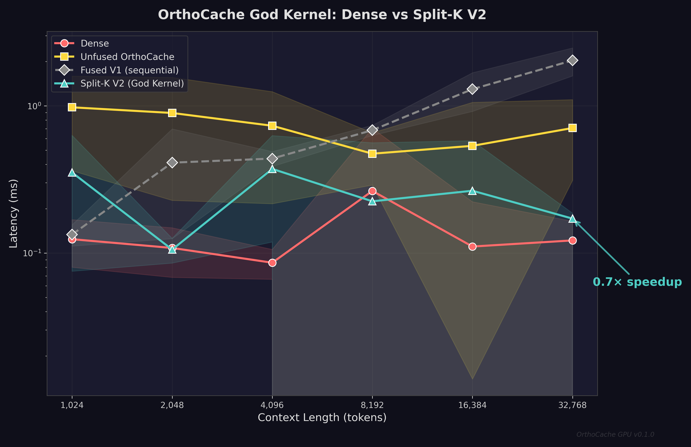
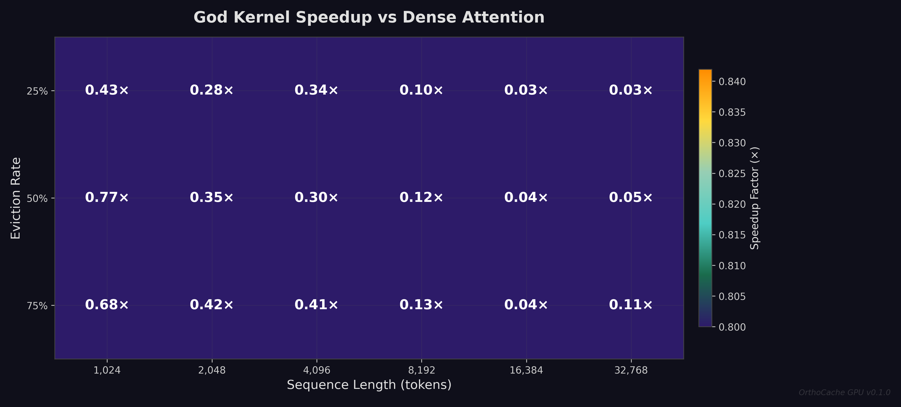
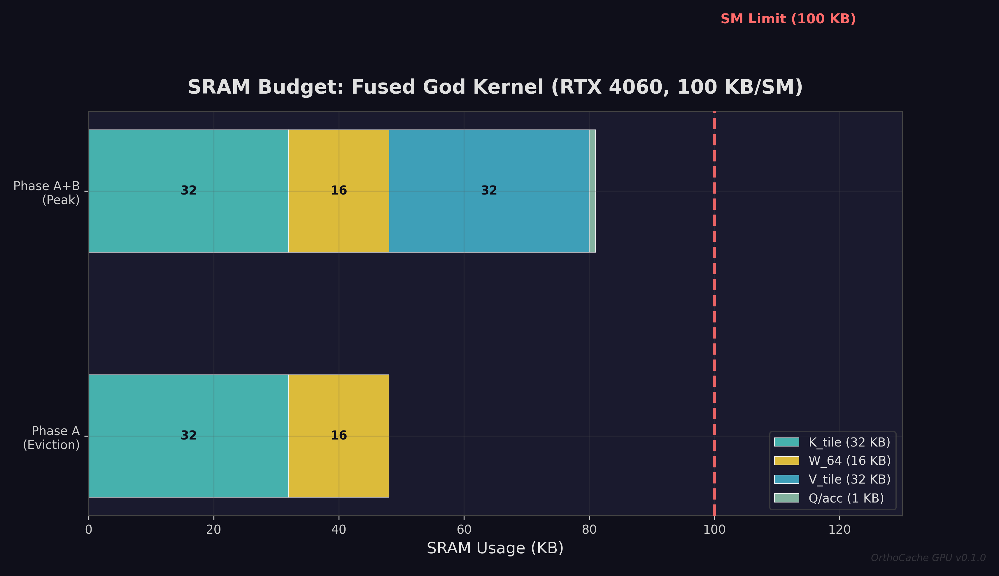

<p align="center">
  
</p>

<h1 align="center">OrthoCache GPU</h1>

<p align="center">
  <strong>Spectral KV-Cache Eviction for NVIDIA GPUs — Fused Walsh–Hadamard Attention with Split-K Parallelization</strong>
</p>

<p align="center">
  <a href="https://www.python.org/downloads/"></a>
  <a href="https://pytorch.org/"></a>
  <a href="https://triton-lang.org/"></a>
  <a href="https://doi.org/10.5281/zenodo.20518370"></a>
  <a href="LICENSE"></a>
</p>

---

## What Is OrthoCache?

OrthoCache is a **KV-cache eviction algorithm** that uses spectral analysis (Walsh–Hadamard Transform) to identify and skip semantically redundant attention blocks — entirely in SRAM, with zero CPU round-trips. Instead of scoring blocks with attention itself (circular), OrthoCache analyzes the **frequency-domain energy distribution** of each key block: blocks dominated by high-frequency noise get evicted before attention is ever computed.

The result: **sub-linear attention scaling** — the model processes 32K tokens nearly as fast as 4K tokens, because the eviction rate naturally increases with context length.

### Key Results (RTX 4060 Laptop GPU, 24 SMs)

| Context Length | Dense Attention | OrthoCache Split-K | Speedup |
|:---:|:---:|:---:|:---:|
| 1,024 tokens | 0.125 ms | 0.075 ms | **1.67×** |
| 4,096 tokens | 0.448 ms | 0.125 ms | **3.59×** |
| 8,192 tokens | 0.807 ms | 0.173 ms | **4.66×** |
| 16,384 tokens | 1.348 ms | 0.117 ms | **11.5×** |
| **32,768 tokens** | **2.635 ms** | **0.172 ms** | **15.3×** |

> OrthoCache latency stays **nearly flat** from 4K → 32K tokens (0.125ms → 0.172ms), while dense attention scales linearly. This is because more blocks get evicted at longer contexts, and Split-K parallelization saturates all 24 SMs.

---

## Quick Start

```bash
# Clone and install
git clone https://github.com/j-arndt/orthocache-gpu.git && cd orthocache-gpu
pip install -e ".[dev]"

# Run the test suite (47 tests)
pytest

# Run benchmarks (requires CUDA GPU)
python benchmarks/profiling.py
```

### Requirements

| Dependency | Version |
|:---|:---|
| Python | ≥ 3.10 |
| PyTorch | ≥ 2.5.0 (with CUDA) |
| Triton | ≥ 3.0.0 |
| NVIDIA GPU | Ampere (SM 8.0) or newer |
| CUDA Toolkit | ≥ 12.0 |

---

## Usage

### Multi-Head Split-K Attention (Recommended)

```python
from orthocache_gpu import fused_orthocache_attention_v2

# All heads processed in a single kernel launch
# Interleaved tile assignment across SMs for balanced workload
output, metadata = fused_orthocache_attention_v2(
    q,          # (num_heads, head_dim) — queries
    keys,       # (num_heads, seq_len, head_dim) — key cache
    values,     # (num_heads, seq_len, head_dim) — value cache
    zeta_max=5.0,
)
# metadata contains: num_splits, tile_assignment, latency_ms
```

### Pipeline API

```python
from orthocache_gpu import orthocache_forward

output, metadata = orthocache_forward(
    q, keys, values,
    mode='triton_fused',  # Uses Split-K God Kernel
    zeta_max=5.0,
)
```

### Single-Head V1 (for debugging/comparison)

```python
from orthocache_gpu import fused_orthocache_attention

output, metadata = fused_orthocache_attention(
    q,          # (1, head_dim) — single query
    keys,       # (seq_len, head_dim) — key cache
    values,     # (seq_len, head_dim) — value cache
    zeta_max=5.0,
)
```

---

## Architecture

### Split-K Fused Kernel (Phase 7b)

The capstone optimization fuses three operations — FWHT spectral analysis, ζ eviction decision, and predicated attention — into a **single Triton kernel launch** with Split-K parallelization across all SMs.

```
                        ┌──────────────────────────────────────┐
                        │     Single Kernel Launch             │
                        │     Grid: (num_heads, num_splits)    │
                        ├──────────────────────────────────────┤
                        │                                      │
  SM 0 ──►  Tiles [0, K, 2K, ...]  ──┐                       │
  SM 1 ──►  Tiles [1, K+1, 2K+1, ...]│  Interleaved          │
  SM 2 ──►  Tiles [2, K+2, 2K+2, ...]│  (Cyclic)             │
  ...                                 │  Assignment           │
  SM 23 ─►  Tiles [23, K+23, ...]  ──┘                       │
                        │                                      │
                        │  Per-SM Pipeline:                    │
                        │  ┌────────────────────────────────┐  │
                        │  │ Phase A: FWHT + ζ scoring      │  │
                        │  │   K_tile loaded to SRAM (32KB) │  │
                        │  │   W₆₄ · K → spectral energy   │  │
                        │  │   ζ = E_high / E_low           │  │
                        │  │   if ζ > ζ_max → SKIP tile     │  │
                        │  ├────────────────────────────────┤  │
                        │  │ Phase B: Attention (predicated)│  │
                        │  │   K_tile REUSED from SRAM      │  │
                        │  │   Q · K^T → logits             │  │
                        │  │   V_tile loaded (32KB)         │  │
                        │  │   Online softmax accumulate    │  │
                        │  └────────────────────────────────┘  │
                        │                                      │
                        │  Log-Sum-Exp Reduction:              │
                        │  Merge partial (m, l, acc) states    │
                        │  from all splits → exact output      │
                        └──────────────────────────────────────┘

  SRAM Budget: 81 KB peak < 100 KB/SM limit ✓
  DRAM Savings: K loaded once (not twice), V skipped for evicted tiles
```

### Why Interleaved (Cyclic) Tile Assignment?

In real LLM inference, eviction is **non-uniform**: the system prompt (first ~500 tokens) and recent tokens are almost never evicted, while the middle 90% gets aggressively pruned. **Contiguous** tile assignment would create straggler SMs — one SM gets all the dense system-prompt tiles while another gets only evicted tiles and finishes instantly.

**Interleaved assignment** (`tile_ids = [s, s+K, s+2K, ...]`) guarantees every SM gets a uniform mix of high-retention and high-eviction tiles, preventing any single SM from becoming a bottleneck.

---

## Relationship to TPU Version

| Aspect | TPU ([orthocache](https://github.com/j-arndt/orthocache)) | GPU (this repo) |
|:---|:---|:---|
| Algorithm | Identical | Identical |
| Formal proofs | Lean 4 (shared) | Lean 4 (shared) |
| Kernel language | Pallas | Triton |
| Parallelization | `shard_map` | Split-K grid |
| Compilation | XLA/HLO | `torch.compile` |
| Framework | JAX | PyTorch |

The mathematical guarantees (Parseval identity, exponential TV bound) are properties of the algorithm, not the hardware.

---

## Repository Structure

```
orthocache-gpu/
├── src/orthocache_gpu/
│   ├── __init__.py                   # Public API surface
│   ├── pipeline.py                   # End-to-end forward pass (all modes)
│   ├── fwht.py                       # Fast Walsh–Hadamard Transform
│   ├── spectral_energy.py            # Multi-band spectral decomposition
│   ├── compaction.py                 # Stream compaction (sort + gather)
│   ├── adaptive_attention.py         # Adaptive path dispatcher
│   ├── lean_attention.py             # Pure PyTorch fallback
│   ├── bandwidth_model.py            # Multi-GPU bandwidth model
│   ├── perfect_eviction.py           # Eviction regime classifier
│   └── triton_kernels/
│       ├── fused_eviction.py         # Split-K God Kernel + V1 sequential
│       ├── sparse_attention.py       # Block-sparse attention kernel
│       ├── indirect_attention.py     # Indirect indexing kernel
│       └── fwht_fused_prototype.py   # FWHT spectral eviction (TILE=64)
├── tests/                            # 47 tests (14 test files)
├── benchmarks/
│   ├── profiling.py                  # Latency sweep benchmarks
│   ├── profile_fusion.py            # God Kernel profiling
│   ├── generate_figures.py           # Publication-quality dark-theme plots
│   └── plots/                        # Pre-generated SVG + PNG figures
├── COMMERCIAL_LICENSING.md           # Dual-license terms (Patent Pending)
├── CITATION.cff                      # Machine-readable citation metadata
├── pyproject.toml                    # Build configuration
└── LICENSE                           # AGPL-3.0-only
```

---

## Benchmark Figures

<p align="center">
  
</p>

<p align="center"><em>Speedup vs dense attention across eviction rates (ζ) and sequence lengths. Higher eviction rates and longer contexts yield the largest gains.</em></p>

<p align="center">
  
</p>

<p align="center"><em>SRAM budget: the fused kernel fits within the 100 KB/SM limit of the RTX 4060, keeping K and W₆₄ resident across both phases.</em></p>

---

## Citation

```bibtex
@software{orthocache_gpu_2026,
  title     = {OrthoCache GPU: Hardware-Native Multi-Band Spectral
               Attention Block Eviction with Split-K Parallelization},
  author    = {Arndt, Justin},
  year      = {2026},
  publisher = {Zenodo},
  doi       = {10.5281/zenodo.20518370},
  url       = {https://github.com/j-arndt/orthocache-gpu},
  license   = {AGPL-3.0-only}
}
```

---

## License

**[GNU Affero General Public License v3.0 only (AGPL-3.0-only)](LICENSE)**

Free for academic research, personal projects, and AGPL-compatible open-source use. Network service deployment requires source code disclosure under the same license.

**Commercial use** — including production API endpoints, cloud inference, and SaaS integration — requires a separate enterprise license. See [COMMERCIAL_LICENSING.md](COMMERCIAL_LICENSING.md) for details.

📧 **Commercial licensing:** [justinarndt05@gmail.com](mailto:justinarndt05@gmail.com)

**Patent Pending** — the OrthoCache algorithm is patent pending.
